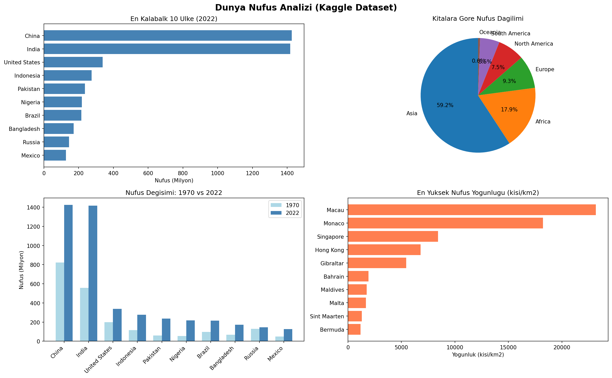

# Dünya Nüfus Analizi

Kaggle'dan alınan gerçek dünya nüfus verisiyle Python kullanılarak yapılmış bir veri analizi projesi.

# Özellikler

- 234 ülkenin nüfus, yüzölçümü, yoğunluk ve büyüme oranı verisi
- 1970, 2000 ve 2022 yıllarına ait nüfus karşılaştırması
- Kıtalara göre nüfus dağılımı
- Terminal üzerinden ülke arama (benzer isim önerisi ile)
- 4 farklı grafik: bar, pasta, scatter, karşılaştırmalı

# Kullanılan Teknolojiler

- Python 3
- Pandas — veri okuma ve analiz
- Matplotlib — grafik çizme

# Nasıl Çalıştırılır?

1. Gerekli kütüphaneleri yükle:
```
pip install pandas matplotlib
```

2. Kaggle'dan veri setini indir:
[World Population Dataset](https://www.kaggle.com/datasets/iamsouravbanerjee/world-population-dataset)

3. `world_population.csv` dosyasını proje klasörüne koy

4. Programı çalıştır:
```
python analiz.py
```

# Dosya Yapısı

```
veri-analizi/
├── analiz.py            ← Ana kod dosyası
├── world_population.csv ← Veri seti (Kaggle)
├── nufus_analizi.png    ← Üretilen grafik
└── README.md
```

# Örnek Çıktı


